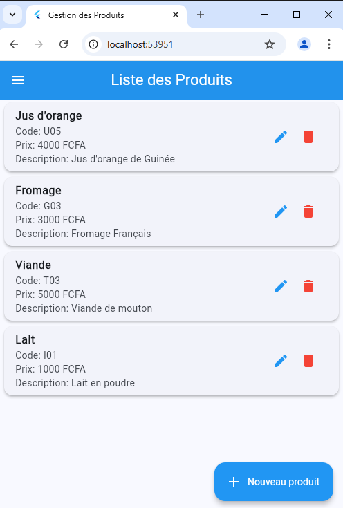
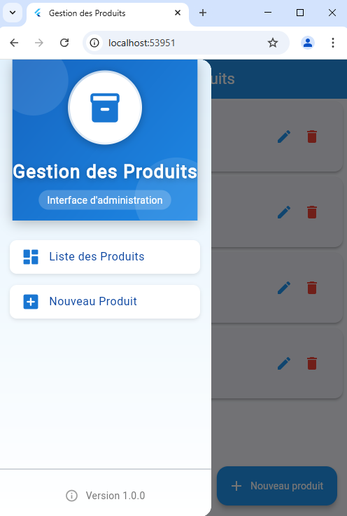
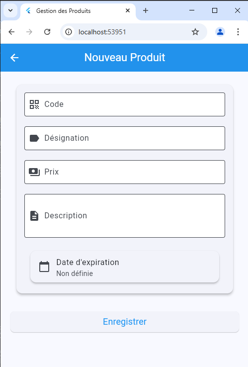

# Gestion des Produits

Une application mobile de gestion de produits développée avec Flutter et Supabase, offrant une interface utilisateur moderne et intuitive pour la gestion de votre inventaire.

## 📱 Fonctionnalités

- ✨ Interface utilisateur moderne et responsive
- 📝 CRUD complet pour les produits (Création, Lecture, Mise à jour, Suppression)
- 💾 Persistance des données avec Supabase
- 🔍 Liste des produits avec recherche
- 📅 Gestion des dates d'expiration
- 🎨 Design Material moderne

## 🛠️ Technologies Utilisées

- Flutter
- Supabase (Backend as a Service)
- Material Design
- Flutter Localizations

## 📋 Prérequis

- Flutter SDK
- Dart SDK
- Compte Supabase
- IDE (VS Code, Android Studio, etc.)

## 🚀 Installation

1. Clonez le repository
```bash
git clone https://github.com/ovvoso/Gestion_Produit.git
```

2. Installez les dépendances
```bash
flutter pub get
```

3. Configurez Supabase
- Créez un projet sur Supabase
- Configurez les variables d'environnement dans `lib/config/supabase_config.dart`

4. Lancez l'application
```bash
flutter run
```

## ⚙️ Configuration Supabase

1. Renommez le fichier `lib/config/supabase_config.example.dart` en `supabase_config.dart`
2. Mettez à jour les valeurs avec vos identifiants Supabase :
```dart
static const String supabaseUrl = 'votre_url_supabase';
static const String supabaseAnonKey = 'votre_cle_anonyme';
```

## 📚 Structure de la Base de Données

Table `produits`:
- `id` (BIGINT, PRIMARY KEY)
- `code` (TEXT, UNIQUE)
- `designation` (TEXT)
- `price` (NUMERIC)
- `description` (TEXT)
- `expiration_date` (TIMESTAMP)

## 🏗️ Architecture du Projet

```
lib/
  ├── config/             # Configuration (Supabase)
  ├── models/            # Modèles de données
  ├── screens/           # Écrans de l'application
  ├── services/          # Services (API Supabase)
  ├── widgets/           # Widgets réutilisables
  └── main.dart         # Point d'entrée de l'application
```

## 📱 Captures d'écran

 ## 📱 Captures d'écran Accueil


 ## 📱 Captures d'écran Menu


 ## 📱 Captures d'écran Formulaire


## 🤝 Contribution

Les contributions sont les bienvenues ! N'hésitez pas à :
1. Fork le projet
2. Créer une branche pour votre fonctionnalité
3. Commit vos changements
4. Push vers la branche
5. Ouvrir une Pull Request

## 📄 Licence

Ce projet est sous licence MIT - voir le fichier [LICENSE.md](LICENSE.md) pour plus de détails.

## 👥 Auteur

[Thierno Maadjou Sow] - [thiernomaadjous@gmail.com]

## 🙏 Remerciements

- Flutter Team
- Supabase Team
- Tous les contributeurs
